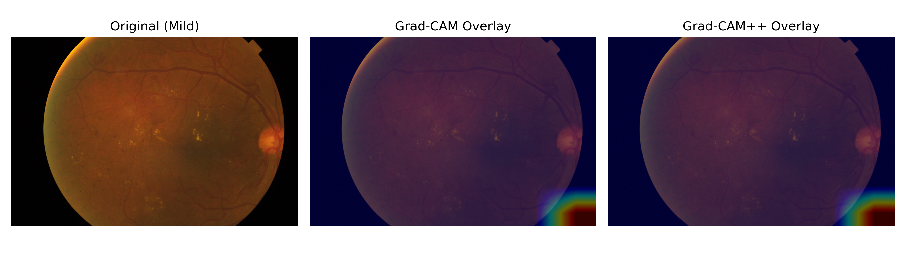
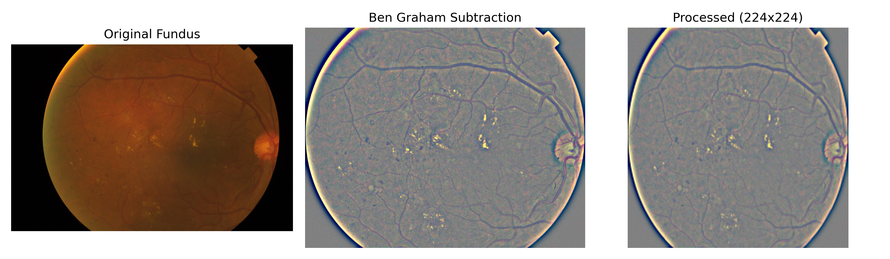
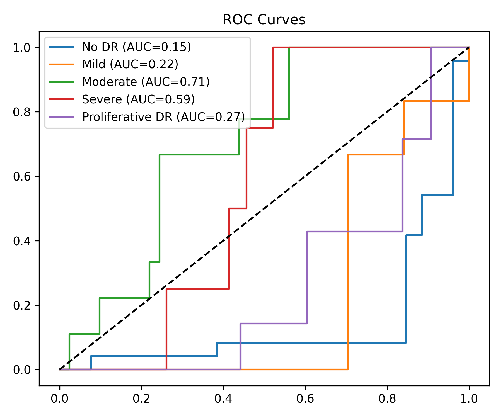
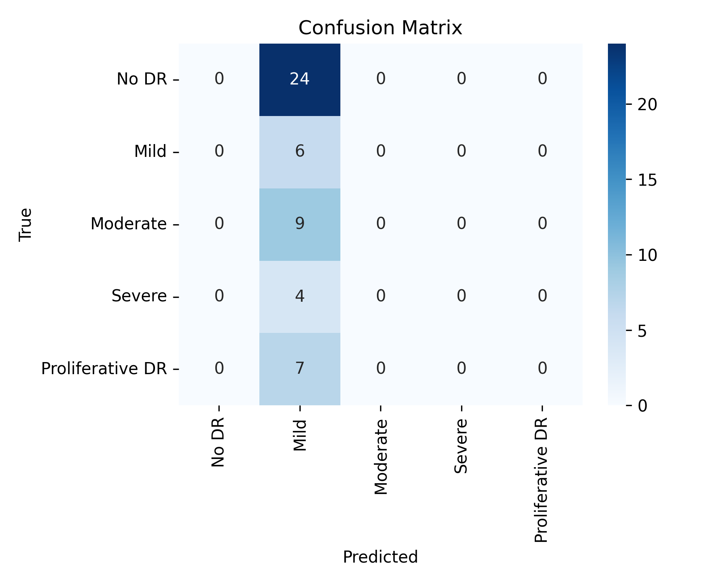
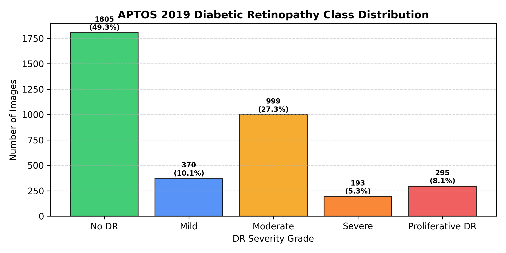

# RetinaX AI — Visual Documentation & Screenshots

This directory contains system screenshots, visualization overlays, and diagnostic model evaluation charts for the **RetinaX AI** Diabetic Retinopathy screening platform.

---

## 📸 Screenshots & Visual Analytics

### 1. Grad-CAM Lesion Heatmap Overlay
Visual explainability heatmap overlay showing retinal lesion highlighting (microaneurysms, hemorrhages, and exudates) generated by EfficientNet-B0.

---

### 2. Ben Graham Preprocessing Comparison
Comparison between raw fundus input and Ben Graham local color subtraction and circular crop preprocessing.

---

### 3. Model Evaluation & ROC Curve
Multi-class ROC curves evaluated across APTOS 2019 test split (Grade 0 - Grade 4).

---

### 4. Confusion Matrix
5-class diagnostic classification confusion matrix showing clinical severity predictions.

---

### 5. APTOS 2019 Dataset Class Distribution
Distribution of severity grades across dataset samples.

---

## 🚀 Key Modules Covered
- **Dashboard & Diagnostic Audit History**: Real-time tracking of patient screening records.
- **Grad-CAM & Grad-CAM++ Visualizer**: Instant visual lesion localization overlays.
- **Ben Graham Image Preprocessing**: High-contrast fundus enhancement pipeline.
- **Patient PDF Report Generator**: Diagnostic report generation with XAI attachments.
